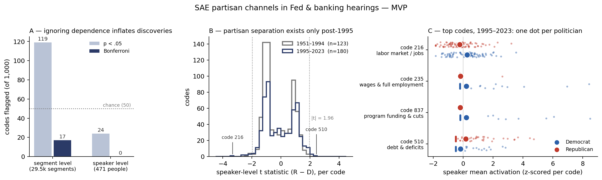

# Partisan Channels in Fed Oversight Speech: a Sparse-Autoencoder Pilot

*Pilot study, August 2026 — stage 2 of the project that replicated Mencattini, Cadei &
Locatello,* Exploratory Causal Inference in SAEnce *(ICLR 2026), in
[`../reproduce_experiment1/`](../reproduce_experiment1/).*

## Why I am running this experiment

My research is text mining in econ/finance/accounting, where the workhorse methods still
*count* — dictionaries, bigrams, MNIR, topic models. They have earned their place because
their output is interpretable and testable, but they hit a ceiling at meaning: frames and
stances that share no phrase are invisible to them. Embeddings capture that meaning, yet
in empirical economics they have stayed prediction inputs rather than measurement — a
1,536-dimensional vector has no axis you can interpret, test, or report. The ECI paper is
the first framework I have seen that credibly converts embeddings *into* measurement: an
SAE decomposes them into individually interpretable channels, and its inference machinery
(NES) disciplines the leakage problem that the counting literature currently patches by
hand.

Concretely, three advantages sit at the construction level, before any result is run:

1. **Measured rather than unmeasurable information loss.** Bigram counting discards
   order, syntax, and negation before analysis begins, with no record of what was lost.
   The SAE's reconstruction objective retains the embedding's content by construction,
   and its reconstruction error is an explicit, reportable bound on the loss.
2. **Context resolves ambiguity.** The same phrase can carry different meanings in
   different uses; a counter aggregates them, a contextual embedding separates them. SAE
   codes have their own meaning problem — entanglement — but it is handled by a
   principled procedure (NES), where the bigram literature handles its version by hand.
3. **Discretion enters at the capacity level, not the content level.** Bigram pipelines
   choose frequency cutoffs and prune vocabularies — decisions that directly determine
   which content can surface. The SAE's tuning knobs (m, k) set resolution only; which
   codes surface is decided by the inference procedure, not the researcher.

The field's caution here is earned: after an early wave of enthusiasm for LLM-based
analysis in accounting and finance (including at Chicago Booth), the retraction of Kim &
Nikolaev's "Context-Based Interpretation of Financial Information" from the *Journal of
Accounting Research* in 2025 — after the published results proved neither quantitatively
nor qualitatively reproducible — along with a number of withdrawn working papers, has
shifted sentiment toward AI as a research *assistant* rather than as the analytical
instrument itself. This pipeline respects that distinction by design: the LLM only
supplies fixed embeddings, and every measurement and test downstream is classical,
transparent, and auditable.

Before proposing this for a real research agenda, I want to know whether it survives
contact with my own field's data — so I replicated the paper first, and this pilot
re-runs the field's canonical partisan-speech measurement on hearing data I already work
with, checking the new method against results the literature already trusts.

**Abstract.** Economists measure partisan language with bag-of-bigram methods (Gentzkow,
Shapiro & Taddy 2019; Cassidy & Kempf 2025). This pilot tests whether the ECI paper's
pipeline — foundation-model embeddings, disentangled by a top-k sparse autoencoder (SAE),
tested code-by-code with dependence-aware inference — recovers and extends that
measurement on 67,080 segments of Fed and banking-committee hearing speech (1951–2023).
Trained without ever seeing a party label, the SAE recovers the canonical partisan split
in Fed oversight (Democrats: jobs and wages; Republicans: debt and deficits), with the
post-1995 timing that GST established for congressional speech at large. A novelty screen
then isolates what bigrams cannot see: candidate partisan *framings* and one design
confound. All findings are hypotheses for a full design, not conclusions.



***Figure.* (A)** Treating 29.5k segments as independent manufactures 17 Bonferroni
"discoveries"; one row per politician (n=471) leaves 0 — the ECI leakage paradox
appearing in real data. **(B)** Speaker-level t statistics across all 1,000 codes:
partisan separation exists only post-1995, matching GST's timing. **(C)** The four
strongest post-1995 codes, one dot per politician: D codes are labor-market and funding
framings, the R code is debt/deficits — the dual-mandate split, recovered unsupervised.

## Why this design

In this corpus the three advantages above are not hypothetical. A frame like *urge
regulators to use their powers* vs. *demand the Fed submit to audit* need not share any
phrase across its instances, so a bigram counter cannot represent it (advantage 1–2). And
the hand-patching is documented practice: Cassidy & Kempf manually neutralize nonsense
bigrams like "top stori" that load on partisanship without meaning it — which is exactly
the ECI paradox, statistically true but semantically empty associations that no
multiple-testing correction removes, and NES is the principled version of that patch
(advantage 3). In finance terms: 1,000 unlabeled codes is the factor zoo (Harvey, Liu &
Zhu 2016) with no priors, and NES is the control-what-you-found instinct of Feng, Giglio
& Xiu (2020).

**Method in one line:** OpenAI embeddings (d=1536) → tied top-k SAE (m=1,000, k=5,
pre-encoder bias; `saelib/`, copied from the validated CelebA replication) → Welch tests
at segment level (naive) and speaker level (honest), plus a novelty screen ranking codes
by |t| × (1 − bigram-AUC) to keep only what a bigram classifier cannot reconstruct.

## Findings

1. **Dependence inflation is large and measurable** (panel A): 17 → 0 Bonferroni
   discoveries — the empirical case for clustered inference.
2. **Timing replicates an external benchmark out of sample** (panel B): pre-1995, 6/1,000
   codes at p<.05 (below the 50 expected by chance); post-1995, the signal appears.
3. **Content matches priors that never entered training** (panel C): code 216 (D,
   jobs/wages, t=−3.3), code 510 (R, debt/deficits, t=+2.4).
4. **The loop closes quantitatively**, per the ECI paper's own ISTAnt validation: against
   a jobs lexicon built *after* discovery, code 216 is the argmax-F1 detector among all
   1,000 codes (F1=0.535, rank 1) — two independent routes land on the same code,
   reproducing the paper's result (their F1=0.398, rank 1/4,608) at higher F1.
5. **The novelty screen surfaces non-lexical candidates** (`output/table/novelty_screen.csv`):
   a framing pair — D: urge regulators to use their powers (code 363) vs. R: demand a Fed
   audit (code 310) — and one confound worth knowing: code 384 tracks majority-party
   chair ceremony, so **chair status confounds party** in any full design.

## Caveats

Party is not randomly assigned — these are systematic differences, not causal effects;
NES stays valid only as the ECI paper's *"rescue system for hypotheses."* The strict
speaker-level Bonferroni gate did not clear (best t=3.3 vs. ≈4.1 at n=180 — the regime
where the ECI paper itself drops Bonferroni). No role controls, hearing strata, or
clustered SEs yet. Findings 4–5 were computed interactively; their artifacts are in
`output/table/` but the screen script is not yet codified. Full lab notes, including
top-activating segments per code: [`MVP_RESULT.md`](MVP_RESULT.md).

**Next:** era-aware analysis, hearing-level strata, sentence-level re-embedding with
m≈6k, NES with speaker-clustered inference, role/majority controls, and — as the finance
hook — whether partisan oversight tone predicts market reactions to Fed communication.

## Reproducing

```bash
pip install -r requirements.txt
python mvp.py        # train SAE + both test levels → output/   (~3 min on an M4)
python plot_mvp.py   # → output/picture/mvp_figure.png
```

`saelib/` is the SAE+NES code vendored from `../reproduce_experiment1/` (the tested
original). Large data files (`data/emb.npy`, `data/meta.parquet`, the 2.2 GB source CSV)
are gitignored; `data/merge_data.py` documents their construction.

## References

- Mencattini, Cadei & Locatello (2026). *Exploratory Causal Inference in SAEnce.* ICLR 2026.
- Gentzkow, M., J. M. Shapiro & M. Taddy (2019). *Measuring Group Differences in
  High-Dimensional Choices: Method and Application to Congressional Speech.*
  Econometrica 87(4), 1307–1340.
- Cassidy, W. & E. Kempf (2025). *Partisan Corporate Speech.* NBER Working Paper 33810.
- Cunningham, H., A. Ewart, L. Riggs, R. Huben & L. Sharkey (2024). *Sparse Autoencoders
  Find Highly Interpretable Features in Language Models.* ICLR 2024 (arXiv:2309.08600).
- Harvey, C. R., Y. Liu & H. Zhu (2016). *…and the Cross-Section of Expected Returns.*
  Review of Financial Studies 29(1), 5–68.
- Kim, A. G. & V. V. Nikolaev. *Context-Based Interpretation of Financial Information.*
  Journal of Accounting Research, Early View, Dec. 2024; **retracted** 2025
  (doi:10.1111/1475-679X.12593).
- Feng, G., S. Giglio & D. Xiu (2020). *Taming the Factor Zoo: A Test of New Factors.*
  Journal of Finance 75(3), 1327–1370.
